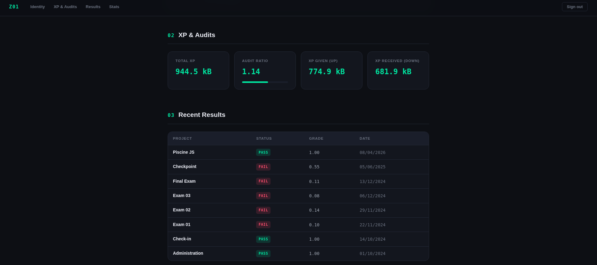

# Zone01 Athens · Student Profile

A single-page application that authenticates against the Zone01 Athens platform and displays a personal student profile, built as part of the GraphQL curriculum project.

🔗 **Live demo: https://nwntaspap.github.io/GraphQL/**

---



---

## What it does

After logging in, the app fetches your school data from the platform's GraphQL API and presents it in four sections:

- **Identity** — your login, user ID, and campus
- **XP & Audits** — total XP earned, audit ratio, XP given and received
- **Recent Results** — your latest project pass/fail results with grades and dates
- **Statistics** — three SVG graphs visualising your journey

---

## Graphs

All graphs are drawn with raw SVG — no chart libraries.

| Graph                     | Type                 | Data source                         |
| ------------------------- | -------------------- | ----------------------------------- |
| XP Earned Over Time       | Line / area chart    | Cumulative XP from all transactions |
| Project Pass / Fail Ratio | Donut chart          | Latest attempt per project          |
| Top 10 Projects by XP     | Horizontal bar chart | Highest XP-earning projects         |

---

## Tech stack

| Layer    | Choice                                                 |
| -------- | ------------------------------------------------------ |
| Language | Vanilla JavaScript (ES Modules)                        |
| Styling  | Plain CSS with custom properties                       |
| API      | GraphQL over HTTP with JWT Bearer auth                 |
| Auth     | Basic auth (base64) to get JWT, stored in localStorage |
| Charts   | Hand-written SVG                                       |
| Hosting  | GitHub Pages                                           |
| Linting  | ESLint + Prettier                                      |

No frameworks, no bundler, no chart libraries — just HTML, CSS, and JS modules loaded directly in the browser.

---

## GraphQL queries used

The project demonstrates all three required query types:

**Normal query**

```graphql
{
  user {
    id
    login
  }
}
```

**Nested query** — transactions and results nested inside user

```graphql
{
  user {
    login
    transactions(where: { type: { _eq: "xp" } }, order_by: { createdAt: asc }) {
      amount
      path
      createdAt
    }
  }
}
```

**Query with arguments** — filtering by type and ordering

```graphql
{
  user {
    results(order_by: { createdAt: desc }) {
      grade
      path
      object {
        name
        type
      }
    }
  }
}
```

---

## Project structure

```
.
├── index.html
├── css/
│   └── styles.css
├── js/
│   ├── app.js       # Entry point — checks auth and routes to login or profile
│   ├── auth.js      # login(), logout(), JWT decode, isAuthenticated()
│   ├── login.js     # Login page UI and form handling
│   ├── api.js       # All GraphQL queries and data processing
│   ├── profile.js   # Profile page UI
│   └── graphs.js    # SVG graph renderers
├── icons/
│   ├── eye.png
│   ├── hidden.png
│   └── graphql.png
├── eslint.config.js
└── package.json
```

---

## Running locally

No build step required. Serve the files with any static server:

```bash
npx serve .
```

Then open `http://localhost:3000`.

You can log in with either your username or email from the Zone01 Athens platform.

---

## Authentication flow

1. User submits username/password
2. App encodes credentials as `base64(username:password)` and POSTs to `/api/auth/signin` with a `Basic` auth header
3. Server returns a JWT
4. JWT is stored in `localStorage` and attached as a `Bearer` token on every subsequent GraphQL request
5. On logout the token is removed and the page reloads

---

## What I learned

- How GraphQL queries work (normal, nested, with arguments and variables)
- JWT structure and how to decode the payload client-side
- Drawing charts from scratch with SVG — coordinate scaling, path commands, donut geometry
- Building a SPA without a framework using ES modules
- Hosting a static site with no build step
